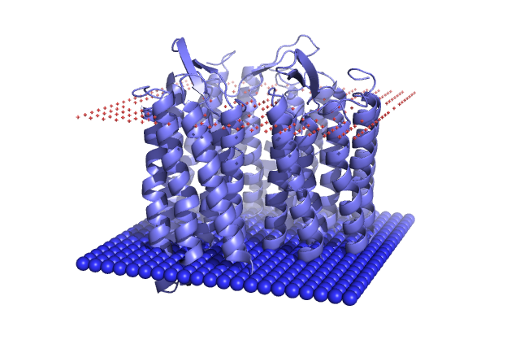

# TMFinder: Locating transmembrane region of proteins

TMFinder is a Python implementation of the paper: [Transmembrane proteins in the Protein Data Bank: identification and classification](https://pubmed.ncbi.nlm.nih.gov/15180935/) by Gábor E Tusnády, Zsuzsanna Dosztányi, and István Simon. The purposeof this application is to find the membrane region of a transmembrane protein given only its 3D structure. The application takes the PDB structure of a transmembrane protein as input and output a another pdb file with the membrane region highlighted by dummy atoms.

<p align="center">
  
</p>

## Features

The membrane is modeled as two parallel planes, defined by a normal vector and two pivot vectors. For each normal vector, a Q value is calculated. Q score takes into account the surface area of the hydrophobic residues and the geometry to determine the likelihood of the normal vector. Q score ranges from 0 to 1 with higher value means the normal vector is more likely to be the membrane normal.

After the optimal normal vector is found, the two planes are expanded as much as possible such that the number of cross segments does not change. The two planes are then used to highlight the membrane region in the PDB file.

## Repo structure

```bash
.
├── tmfinder
│   ├── biodata.py # Reading and cleaning PDB file
│   ├── geometry.py # Geometric operations, i.e. point sampling on a sphere; center of mass, rotational axis calculation...
│   ├── slicer.py # Slicing the protein into two parallel planes, calculating the Q score, normal vector searching
│   ├── utils.py # Utilities
│   └── visualization.py # Modifying the PDB file to highlight the transmembrane region.
├── tmfinder.log # Log file
├── README.md
├── environment.yml # Installation
└── find_membrane.py # Command line interface
```

## Installation:

```bash
git clone https://github.com/XuanVuNguyen/TMFinder.git
cd TMFinder
conda env create -f environment.yml -p ./env/
conda activate env/
```

## Usage:

### As a command line
Simple usage:
```bash
python find_membrane.py -i=4qi1.pdb -o=4qi1_membrane.pdb
```
An output file `4qi1_membrane.pdb` will be created with the membrane region highlighted, and it can be visualized in PyMol.

To see the full list of arguments, run:
```bash
python find_membrane.py -h
# Output:
usage: find_membrane.py -i IN_PDB [-o OUT_PDB] [-l LOG] [-w WIDTH] [-n N_NORMALS] [-r RAND] [--help]

TMfinder: Locating transmembrane regions of proteins.

required arguments:
  -i IN_PDB, --in_pdb IN_PDB
                        Input PDB file

optional arguments:
  -o OUT_PDB, --out_pdb OUT_PDB
                        Output PDB file. Defaut: <input>_tmfinder.pdb
  -l LOG, --log LOG     Log file. Default: tmfinder.log
  -w WIDTH, --width WIDTH
                        Width of the slicer. Default: 15 (angstrom)
  -n N_NORMALS, --n_normals N_NORMALS
                        Number of normal vectors to be sampled. Default: 5000
  -r RAND, --rand RAND  Random seed. Defaut: None.
  --help, -h            show this help message and exit
```

### As a Python module
```python
from tmfinder.slicer import ProteinSlicer
from tmfinder.biodata import remove_hetatm
from tmfinder.visualization import add_atom_plane

parser = PDBParser()
structure = parser.get_structure('4qi1', '4qi1.pdb')
remove_hetatm(structure)
model = structure[0]

slicer = ProteinSlicer(model,
                       width=15,
                       n_normals_sample=5000,
                       )

slicer.fit_normal()
print("Fitted normal vectors: ", slicer.normal_vectors)
print("Fitted Q value: ", slicer.Q_score)

# Move the two pivots 0.5 angstrom per step until the number of cross segments changes
slicer.expand_pivots(step=0.5)
print("Pivots: ", slicer.pivot1, slicer.pivot2)

add_atom_plane(structure[0],
                model_com,
                normal=slicer.normal,
                pivot=slicer.pivot1,
                edge=21,
                element="N",
                space =3)
add_atom_plane(structure[0],
                model_com,
                normal=slicer.normal,
                pivot=slicer.pivot2,
                edge=21,
                element="O",
                space =3)

io = PDBIO()
io.set_structure(structure)
io.save("4qi1_membrane.pdb")
```
